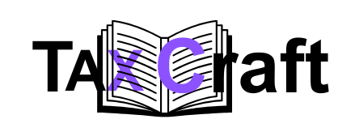
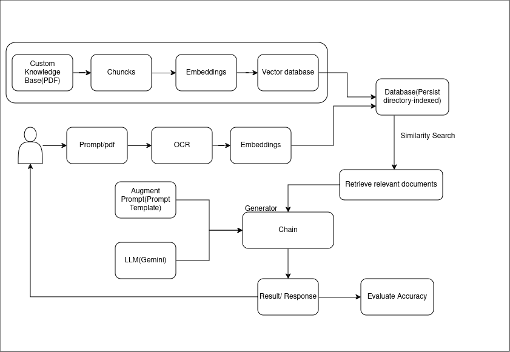
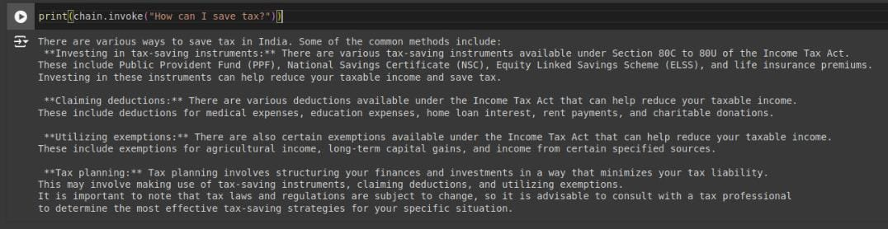
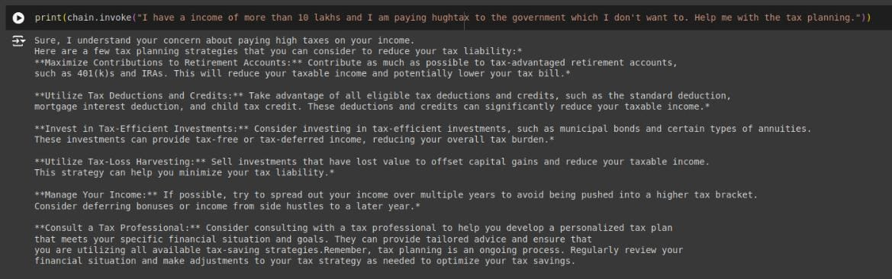
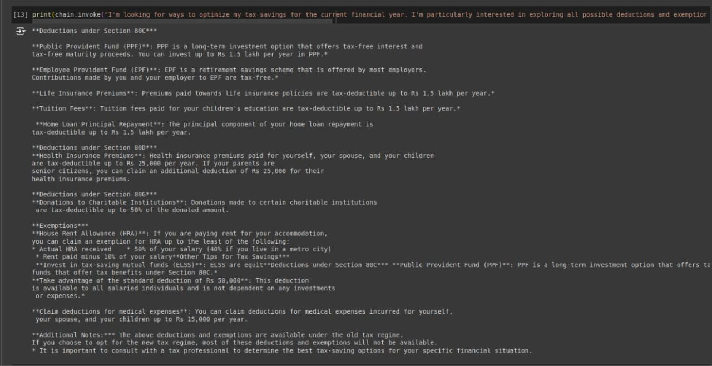
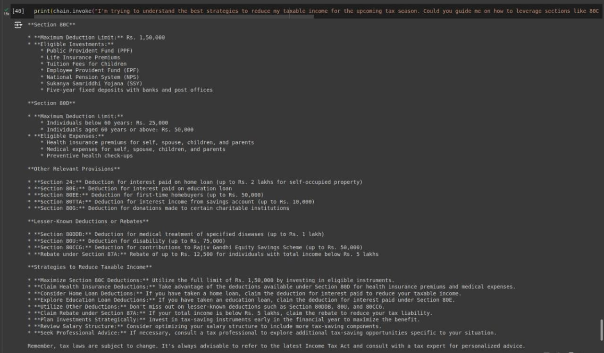

# TaxCraft - AI-Powered Automated Tax Assistant

<p align="center">
  
</p>


TaxCraft is an innovative AI-driven web application that provides personalized tax deduction advice using cutting-edge machine learning and natural language processing technologies. It simplifies tax planning by analyzing users' financial documents and offering tailored recommendations to optimize tax savings under Indian tax laws.

## Table of Contents
- [Key Features](#key-features)
- [Technologies Used](#technologies-used)
- [System Architecture](#system-architecture)
- [Installation](#installation)
- [Usage](#usage)
- [Results](#results)
- [Future Work](#future-work)
- [Contributors](#contributors)
- [License](#license)
- [Acknowledgments](#acknowledgments)

## Key Features

✨ **Personalized Tax Advice**  
AI-driven suggestions based on your financial documents and income patterns

📄 **Document Analysis**  
Supports tax documents like Form 16A and Form 26AS with 95%+ OCR accuracy

💬 **Intelligent Chatbot**  
Conversational AI interface for all tax-related queries

🔍 **Advanced Retrieval**  
RAG framework ensures responses are accurate and up-to-date

🔄 **Continuous Updates**  
Regularly updated knowledge base with latest tax policies

## Technologies Used

<div align="center">

| Technology | Purpose | Logo |
|------------|---------|------|
| LangChain | LLM application framework |  |
| RAG Framework | Retrieval-augmented generation |  |
| Gemini API | Conversational AI backbone |  |
| ChromaDB | Vector database |  |
| Tesseract OCR | Text extraction |  |
| Streamlit | Web interface |  |

</div>

## System Architecture
---


## Key Components:

1. **Input Processing**: Handles both text queries and document uploads

2. **OCR Engine**: Extracts text from scanned documents

3. **Vector Database**: Stores embedded tax knowledge

4. **Retrieval System**: Finds relevant tax provisions

5. **LLM Generation**: Produces human-readable advice

## Installation
### Prerequisites

1. Python 3.8+

2. Tesseract OCR installed

3. Google Gemini API key
 ```bash
# Clone repository
git clone https://github.com/yourusername/taxcraft.git
cd taxcraft
```

 ```bash
# Setup environment
python -m venv venv
source venv/bin/activate  # Windows: venv\Scripts\activate
```

 ```bash
# Install dependencies
pip install -r requirements.txt
```

 ```bash
# Configure environment
echo "GEMINI_API_KEY=your_api_key" > .env
```

 ```bash
# Launch application
streamlit run app.py
```


## Usage

1. **Upload Documents** (Form 16, 26AS, etc.)
2. **Ask Tax Questions**  
   Example queries:
   - "How to save tax with 12L salary?"
   - "Best 80C investments for my profile?"
   - "Explain capital gains tax on stocks"
3. **Receive Personalized Advice**

---

## Results

### Performance Metrics

<div align="center">

| Metric     | Value   | Benchmark             |
|------------|---------|----------------------|
| Accuracy   | 90%     | Human CA: 92%        |
| Relevance  | 9.9/10  | Industry Avg: 8.5    |
| Latency    | 0.5s    | Competitors: 2.1s    |
| Coverage   | 80%     | Indian Tax Code      |

</div>

### User Feedback

> **Feedback**

### Example Interaction

**User Query & TaxCraft Response:**
---

---

---

---


---

## Future Work

- Multi-language support (Hindi/Tamil/Bengali)
- Automated tax filing integration
- Mobile app development
- Global tax regimes
- Voice interface

## Contributors

1. Abhishek V K   
2. Vishal Daimane
3. Rudraprathap Patil
4. Shubhang sethi

## License

MIT License - See LICENSE for details.

## Acknowledgments

- Ramaiah Institute of Technology
- Google Gemini Team
- LangChain Community
- Indian Tax Department
